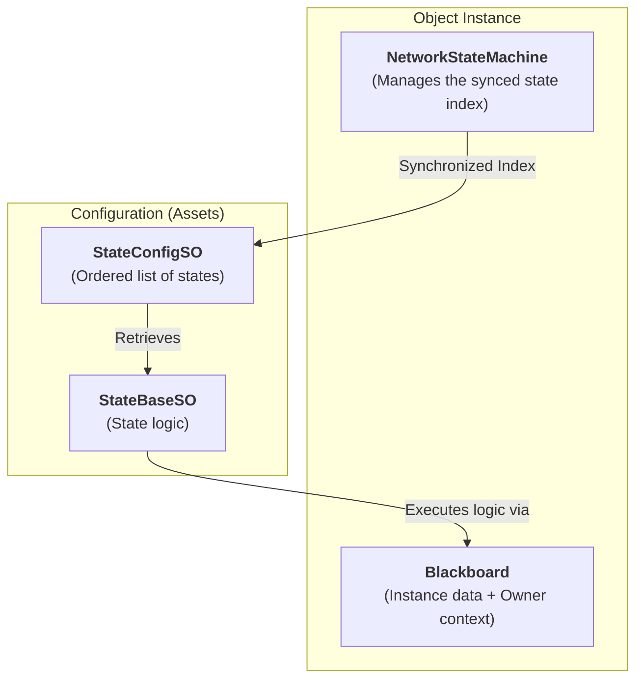
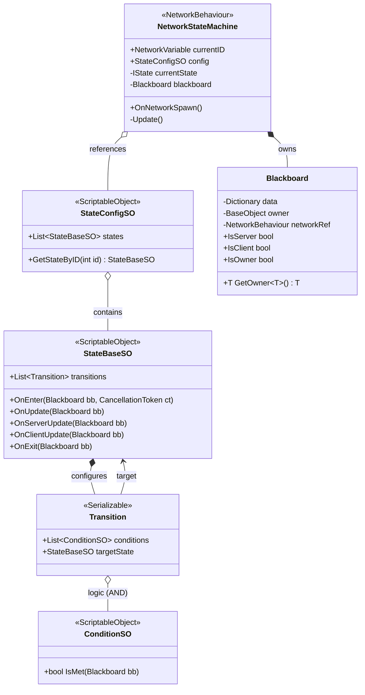
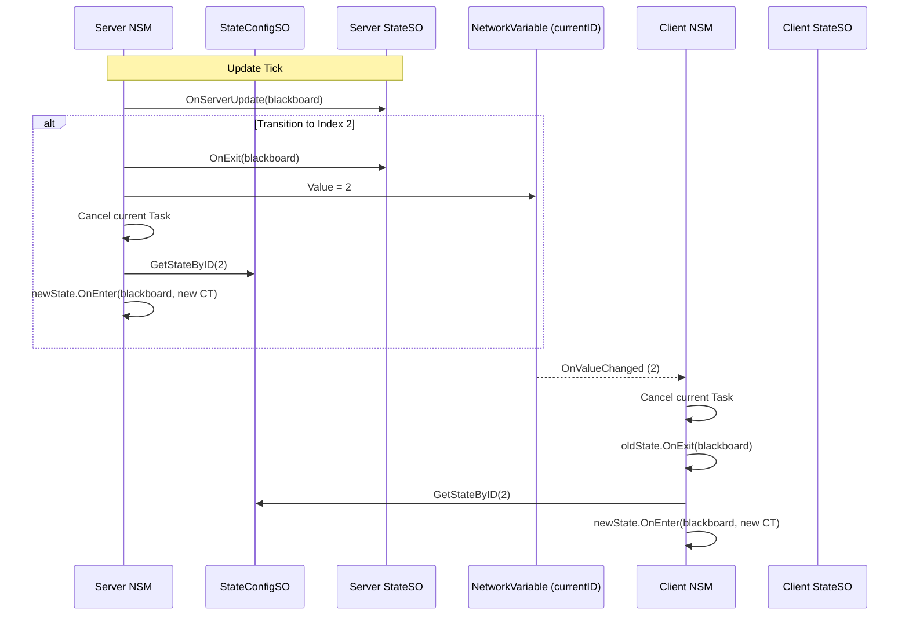

# Guide: ScriptableObject Network State Machine

This document explains how to use and extend the server-authoritative network state machine system implemented for the FallGuys project.

## 1. Global Architecture

The system is built on two pillars:
- **Assets (ScriptableObjects)**: Contain the shared logic (States and Conditions).
- **Instances (MonoBehaviours)**: Manage the network state (`NetworkVariable`) and instance-specific data (`Blackboard`).

### Communication Schema


### Technical Architecture (UML)


### Network Flow (Sequence)


---

## 2. How to Create a New State?

### Step 1: Create the Script
Create a new C# script inheriting from `StateBaseSO`. Use the appropriate network hooks.

```csharp
[CreateAssetMenu(fileName = "NewState", menuName = "StateMachine/States/MyNewState")]
public class MyNewStateSO : StateBaseSO
{
    public override void OnServerUpdate(Blackboard bb)
    {
        // Authoritative logic (Server only)
        var owner = bb.GetOwner<BaseObject>();
        if (owner.SomeValue > 10) { /* ... */ }
    }

    public override void OnClientUpdate(Blackboard bb)
    {
        // Visual logic (Clients only)
    }
}
```

### Step 2: Create the Asset
In Unity: `Right-Click -> Create -> StateMachine -> States -> MyNewState`.

### Step 3: Registration
Add your new asset to the `States` list of your **`StateConfigSO`** asset. The index in this list will be the identifier used on the network.

---

---

## 4. Understanding Update Hooks

The state machine provides three distinct update hooks to handle network roles efficiently:

### A. `OnUpdate(Blackboard bb)`
- **Executed on**: Server AND All Clients.
- **Usage**: Shared logic that doesn't affect authority but needs to be seen by everyone.
- *Examples*: Standard movement interpolation, rotating constant objects.

### B. `OnServerUpdate(Blackboard bb)`
- **Executed on**: Server ONLY.
- **Usage**: Authoritative logic, physics modifications, damage calculation, and transition checks.
- *Examples*: Increasing score, checking if a player is in a zone, evaluating transitions.

### C. `OnClientUpdate(Blackboard bb)`
- **Executed on**: Clients ONLY (Owner + Proxies).
- **Usage**: Purely visual or local logic.
- *Examples*: Camera shake for the owner, pulsating UI, spawning local particles.

---

## 5. How to Create a New Condition?

Just like states, conditions are reusable ScriptableObjects.

### Step 1: Create the Script
Create a script inheriting from `ConditionSO`.

```csharp
[CreateAssetMenu(fileName = "IsReadyCondition", menuName = "StateMachine/Conditions/IsReady")]
public class IsReadyConditionSO : ConditionSO
{
    public override bool IsMet(Blackboard bb)
    {
        var owner = bb.GetOwner<BaseObject>();
        return owner.IsReady; 
    }
}
```

### Step 2: Create the Asset
`Right-Click -> Create -> StateMachine -> Conditions -> IsReady`.

---

## 4. Transitions (AND / OR)

Transitions are configured directly in the Inspector of each `StateSO`.
- **AND Logic**: Add multiple conditions to a single transition entry. They must all be true.
- **OR Logic**: Add multiple transition blocks. If any block is validated, the state change occurs.

---

## 5. Data Access (Blackboard)

Since `StateSO` assets are shared, **never store runtime variables inside them**. Use the `Blackboard`:

- **Read data**: `bb.Get<float>("myVar")`
- **Write data**: `bb.Set("myVar", 10f)`
- **Access Owner**: `bb.GetOwner<T>()`

---

## 6. Async Safety

The system uses `CancellationToken`. If you start an asynchronous task in `OnEnter`, the system will automatically cancel it if the object changes state before the task completes.

---

## 7. Owner vs All Clients

By default, hooks like `OnEnter`, `OnUpdate`, and `OnClientUpdate` execute on **every client** that sees the object (the owner and the proxies).

If you want to run code **only for the player who controls the object** (e.g., local UI, camera shake, input reading):

```csharp
public override void OnClientUpdate(Blackboard bb)
{
    if (bb.IsOwner) 
    {
        // Only the local player sees this
        Camera.main.backgroundColor = Color.red; 
    }
}
```

### Summary Table
| Role | Blackboard property | Typical Usage |
| :--- | :--- | :--- |
| **Server** | `bb.IsServer` | Scoring, Health changes, Physics validation. |
| **All Clients** | `bb.IsClient` | VFX, Sounds, Animations (synced for everyone). |
| **Owner Client** | `bb.IsOwner` | Input recording, HUD Update, Local Camera effects. |
| **Proxy Client** | `!bb.IsOwner` | Interpolation fluff (Rarely used directly). |
